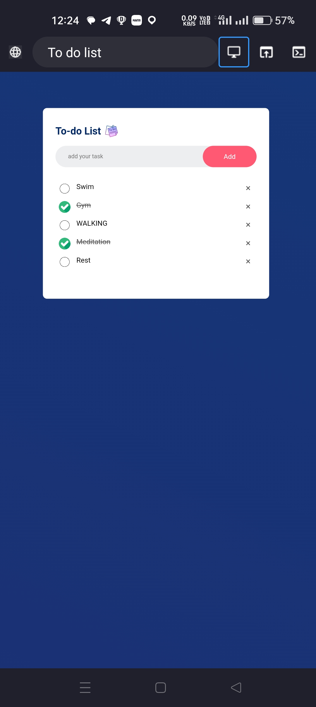

# To-Do List Web App

A simple and responsive To-Do List web application built using HTML, CSS, and JavaScript. This app allows users to add, complete, and delete tasks, with persistent storage using the browser’s localStorage API.

## Features

* **Add Tasks**: Easily add new tasks to your to-do list.
* **Mark as Completed**: Click on a task to mark it as completed (strikethrough style).
* **Delete Tasks**: Remove tasks with a single click on the delete icon.
* **Data Persistence**: Tasks are saved in local storage, so they remain after refreshing or closing the browser.
* **Responsive Design**: Clean, modern UI that adapts to various screen sizes.

## Preview

 

## Technologies Used

* **HTML5** – Structure of the web page.
* **CSS3** – Styling and lay
* **JavaScript (Vanilla)** – Functionality and local storage integration.

## Installation & Usage

1. **Clone the repository**:

   ```bash
   git clone https://github.com/yourusername/todo-list.git
   cd todo-list
   ```

2. **Open in Browser**:

   You can simply open the `TD.html` file in any modern browser:

   ```bash
   open TD.html
   ```

   Or drag and drop the file into your browser window.

## Project Structure

```
todo-list/
│
├── TD.html         # Main HTML file
├── Td.css          # Stylesheet for the app
├── TD.js           # JavaScript logic
└── assets/         # Folder for icons/images (checked.png, unchecked.png, sticky-note.png)
```

## Credits

* Icons and design inspiration by your own creativity or freely available resources.
* Developed by \SINGH VISHAL.

## License

This project is open-source and free to use under the [MIT License](LICENSE).

